# Ollie the Dog's UWB Collar
## ESP 32 UltraWideBand (UWB) Indoor position sensing with 3d web visualization (using three.js)
### Table of Content
 

- [Ollie the Dog's UWB Collar](#ollie-the-dogs-uwb-collar) 
- [What is the goal of this project?](#what-is-the-goal-of-this-project) 
- [Who is Ollie the Dog?](#who-is-ollie-the-dog) 
- [What do we mean by display/visualize Ollie's position in 3d on the web?](#what-do-we-mean-by-displayvisualize-ollies-position-in-3d-on-the-web)
- [What is Ultra-WideBand (UWB)?](#what-is-ultra-wideband-uwb) 
- [How does UWB measure distance and positoin?](#how-does-uwb-measure-distance-and-positoin) 
- [Why does UWB matter? Who cares?](#why-does-uwb-matter-who-cares) 
- [Is Ollie's dog collar a realistic business/startup idea?](#is-ollies-dog-collar-a-realistic-businessstartup-idea) 
- [What companies are using UWB chips/circuits?](#what-companies-are-using-uwb-chipscircuits) 
- [How will this work Technically?  #Overview](#how-will-this-work-technically--overview) 

___
 
 
 
 

# What is the goal of this project?
## To build a UWB dog collar for Ollie the Dog

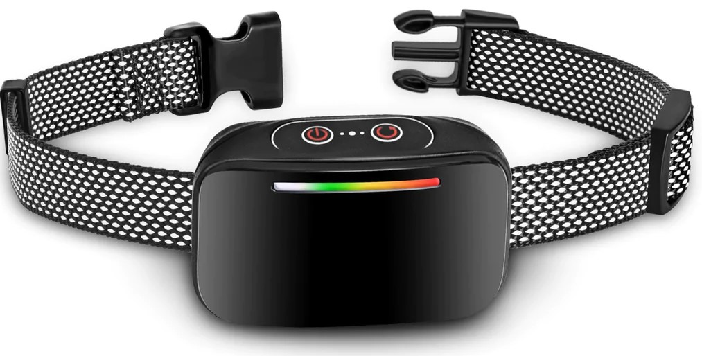
## Goals
1. Record his 3d position every 15 seconds (indoors or outdoors)
2. Set geo-boundries (e.g. kitchen counter) that beep when he enters
3. Display Ollie's activity/position in 3d via web [details below](#what-do-we-mean-by-displayvisualize-ollies-position-in-3d-on-the-web)

 
 
 
 

____

# Who is Ollie the Dog?
## Mike & Nour Baird's "good boy" in Lakewood, Ohio
### Ollie, Mike, Nour at the Bar (Lakewood Truck Park - Dec 2021)
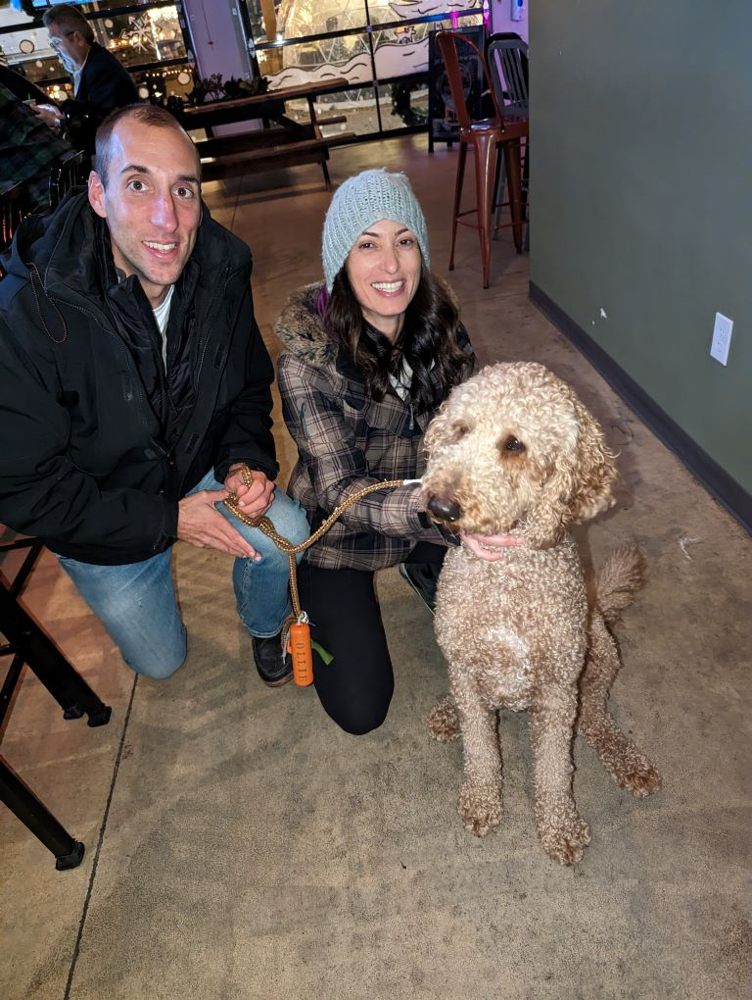
### Ollie Relaxing with no worries.  Ollie Don't Care!!!
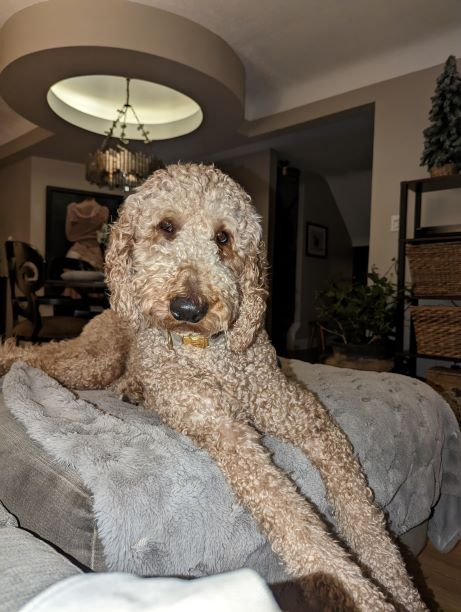
 
 
 
 

____

# What do we mean by display/visualize Ollie's position in 3d on the web?
I didn't want to use 3d engines like Unity or Unreal that require installing software (setup.ext, msi, etc.) for maintenance and simplificaiton reasons.  Web technology has advanced with cool libraries like [three.js](https://threejs.org/manual/#en/fundamentals) simplifying WebGL to make  [examples like this possible](https://threejs.org/examples/#webgl_animation_keyframes)
 
Here is an early prototype of [visualizing Ollie's position in 3d](https://zobo.dev/uwb-in-3d). The dog is not moving yet so you have to use your imagination to visualize the dog walkign and leaving the yellow dots showing its position

source: [zobo.dev](https://zobo.dev/uwb-in-3d)
 
 
 
 

____

# What is Ultra-WideBand (UWB)?
## It's like GPS positioning that works indoors
A radio frequency that is [high frequency (often 6GHz to 9GHz)](https://en.wikipedia.org/wiki/Radio_spectrum) and low energy.  Other radio frequencies like FM Radio operate at ~100 MHz so it's infrequent and has a large radio wavelength measured in meters.  [Ultra Wideband](https://en.wikipedia.org/wiki/Ultra-wideband) is fast often operating at 6GHz with a wider band and small wavelenght measured in centemeters.  

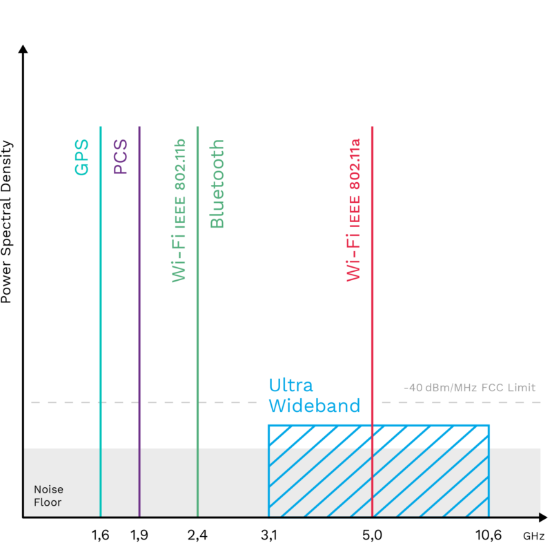
This allows locating through geometery/triangulation (similar to GPS) using anchors and tags
 
 
 
 

____

# How does UWB measure distance and positoin?
## It measures distance using time of radio wave response
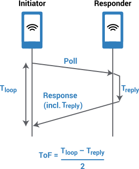
## UWB chips use anchors (fixed stations) and tags (moving chips) to measure X, Y, and Z position
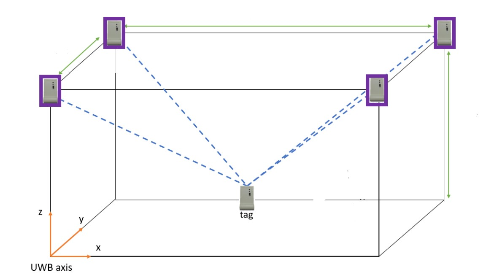
 
 
 
 

____

# Why does UWB matter? Who cares?
## For the first time in history, we can ***accuratly*** measure indoor postion
### 5 years ago this wasn't possible
 

### A solution trying to find a problem ;)
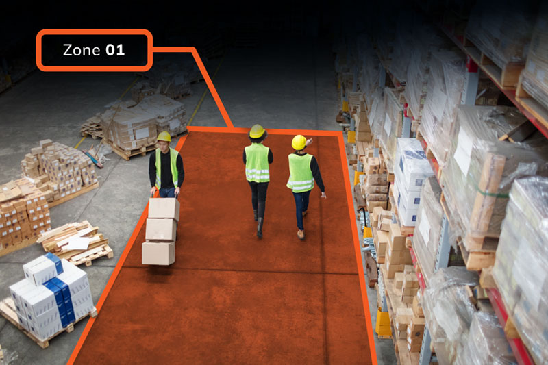
- ***Warehouse/Factory safety*** - sensing of worker location and machinery (ie auto kill switch)
- ***Interior Design/Construction*** - walk around house and measure/model the floorplan in 3d
- ***VR/AR video games*** - multiplayer with location in real-world (think augmented paintball)
- ***Pet training*** - geofences to keep [dogs in the yard](https://www.invisiblefence.com/solutions/outdoor)
    - Current tech is either wired (buried under grass) or GPS for 6+ acre properties. current tech doesn't work indoors.  Imagine putting geofences on your kitchen counter and couch. 
  
## What are some real world uses YOU can think of?
 
 
 
 

____

# Is Ollie's dog collar a realistic business/startup idea?
## No... at least not for Mike Baird (Ollie's best friend and the creater of this project)
## Huge Industry
The pet industry does about $110 billion in revenue. Its too big for a small individual/starup to compete in without existing connections, capital, or a larger team.
## Lots of competitors (and sophisticated ones) 
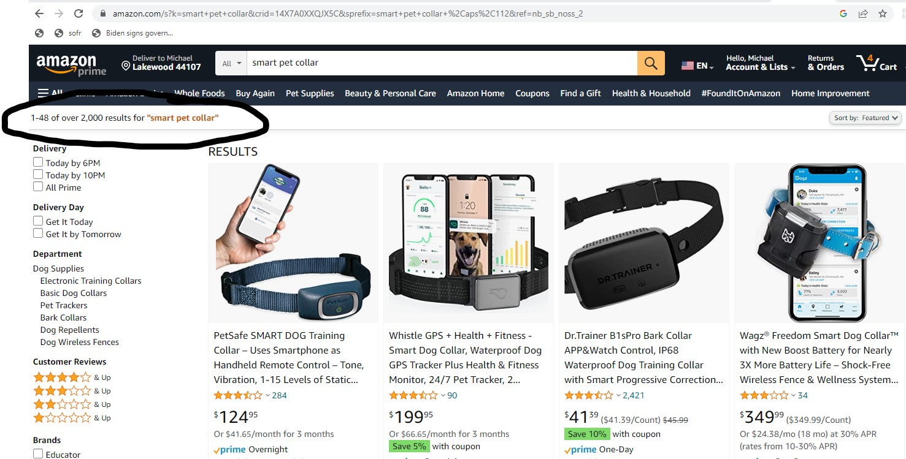
and the existing players in the space (e.g. [Invisible Fence](https://www.invisiblefence.com/our-company)) that have over 10,000 employees and 3+ million customers. 
Still, these competitors do have limitaitons (as of 1/18/2022):
1. ***GPS is not accurate*** - per their own insturctions its not recommended for homes with less than 6 acres. for < 6 acres you need to do an expensive install burying wires
2. ***RFID chips dont track position*** there are some solutions to put RFID pods on your kitchen counter that been when the dog approaches, but this technology doesn't allow for activity tracking.  plus you need a different/seperate solution to put up the fence around the peremiter of your home. UWB is a all-in-one solution

In 10 years from now, these existing competitors will have UWB products on the market

## Ping me if you have a niche UWB use case
I'm doing this project for learning and fun.  Ollie don't care, but his bestie does.  If you brainstorm a good/niche use case that is less "big", ping me and we can partner.  Loves me some cool tech & startups

 
 
 
 

____

# What companies are using UWB chips/circuits?
## Over the past few years tech companies (Apple & Samsumg) [announced products](https://en.wikipedia.org/wiki/Ultra-wideband#Products)
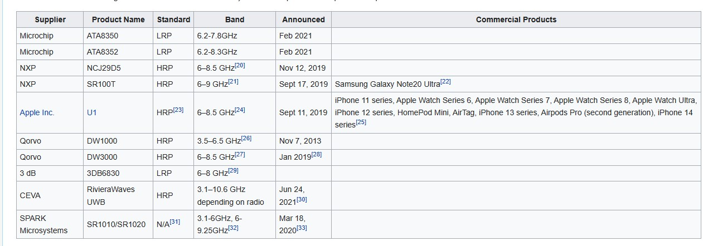
 
 
 
 

____

# How will this work Technically?  #Overview
This project uses Makerfabs [ESP32 UWB (Ultra Wideband) Microcontroller](https://www.makerfabs.com/esp32-uwb-ultra-wideband.html) to perform indoor position sensing.  We calculate the X, Y, and Z for a 3d position sense.
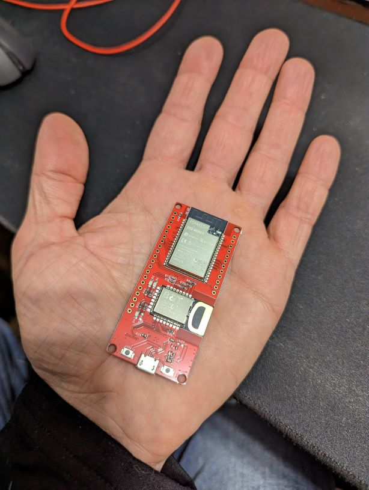
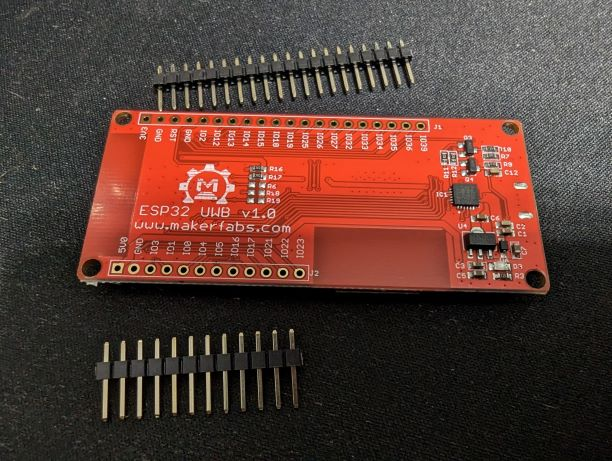
____________________
### I have 4 microcontrollers all plugged into a USB hub for R&D
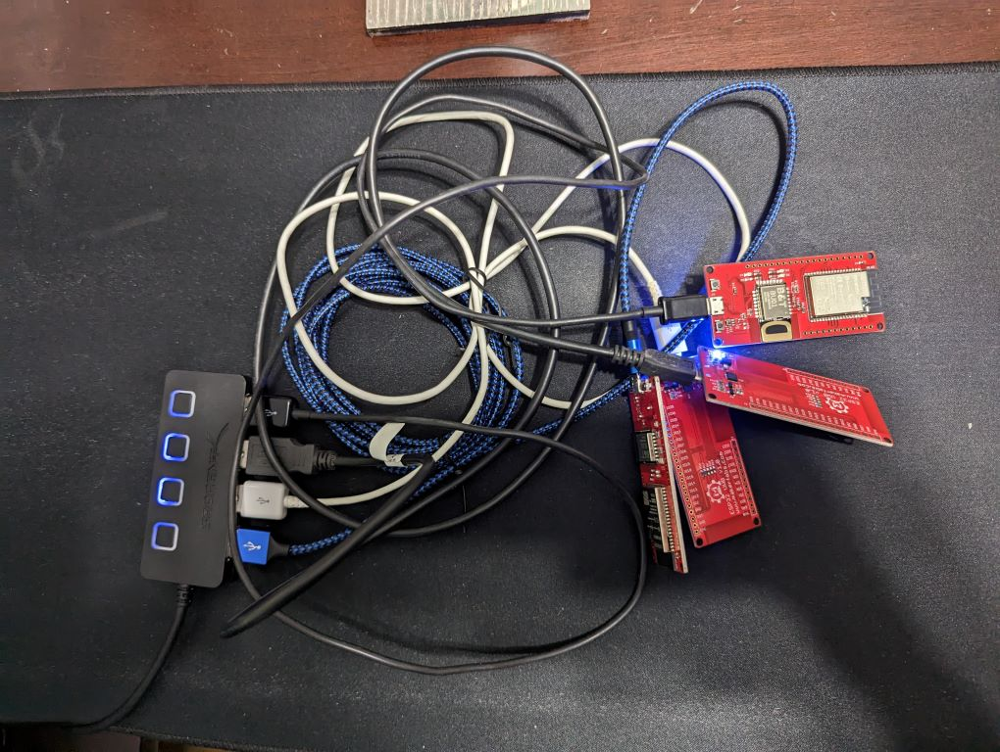
____________________
### This magic of the makerfabs esp32 uwb dev board is the [decawave (now acquired by Qorvo) DW1000](https://www.qorvo.com/products/p/DW1000) ultra wide band chip. 
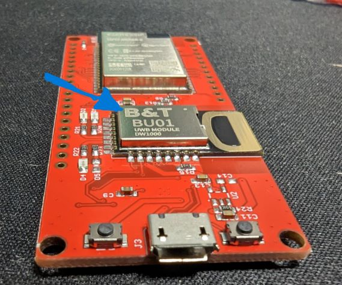

 
 
 
 

____

## What range does my testing achive?
### Only 8 meters maximum distance
- **8 meters is a Deal Breaker** 8 meters (25 feet) was the maximum distance I could achieve within my house. Even in clear-line-of-sight (ie no walls or obstructions between the microcontroller) I could not get above 8 meters. 
- **80% False Advertising** Makerfabs advertised 45 meters (85 feet), this must be "theoretical" 45 meters in a outer space with no objects or radio waves around.  
- **Tried Multiple ways to increase distance**
  - **Range Modes** Tried multiple range MODES but none of them exceeded 8 meters.  Other [UWB Distance Tests on Github](https://github.com/jremington/UWB-Indoor-Localization_Arduino)  found MODE_LONGDATA_RANGE_LOWPOWER "range up to 33 m. All other options lead to 5-10 m at best." 
    - **33 meters REALLY??** I was unable to reproduce these results
    - [ ] **TODO: Double the TX (Transmitter) power** as seen on this [git repo](https://github.com/jremington/UWB-Indoor-Localization_Arduino/blob/main/DW1000_library_highpower/src/DW1000.cpp) "last update 5/30/22 line 650 doubled TX_POWER to 0x28"
  - **Clear line of sight** I tried tests with objects and walls in the way.  Compared to clear/straight open air tests the results did not vary much.  This indicated UWB is decent at moving through walls.
- **New Product ESP32 UWB Pro** [ high power UWB launched by makerfabs.com](https://www.makerfabs.cc/product/esp32-uwb-high-power-version-120m.html) with an advertised 200 meter distance/range.
    - **Makerfab's realized their problem** This was released about a year after I purchased the original chip. 
    -  **Still 80% overestimating/ false advertising? = 40 meters (120 feet)**  If the new chip is about the same 80% hopium advertisement as their original UWB chip... it will achive 40 meters (120 feet) of the 200 meters they advertise.   
        -  The regular ESP32 UWB I tested is advertised at 45 meters but my testing indicates 8 meters maximum distance. Approximatly 20%
     -  **Is it worth $300 to test the new chip's distance?** (5 chips needed @ $55 each for X*2,Y,Z, Tag anchors for 3d position)
     -  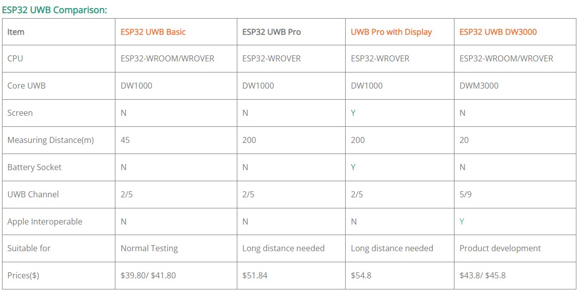
